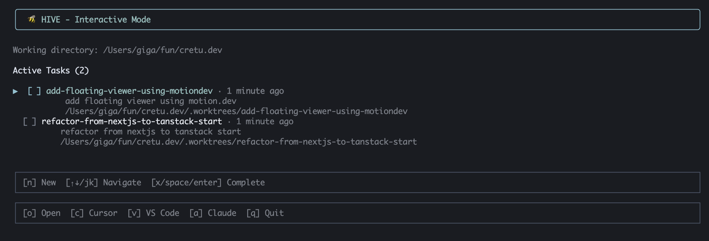

# 🐝 Hive

parallel ai agents without the pain


---

you know the deal. you want 3 agents working on 3 tasks. but they all stomp on each other's files. git history becomes a nightmare. you're back to being single-threaded.

hive fixes this. git worktrees + a nice cli. each agent gets its own branch, its own directory, its own sandbox. work in parallel. merge what works. drop what doesn't.



## install
```bash
# npm i -g  xxxxxx (coming soon)
```

## why

because alt-tabbing between branches is mass and ai agents don't know how to share

## license

MIT. do whatever you want.